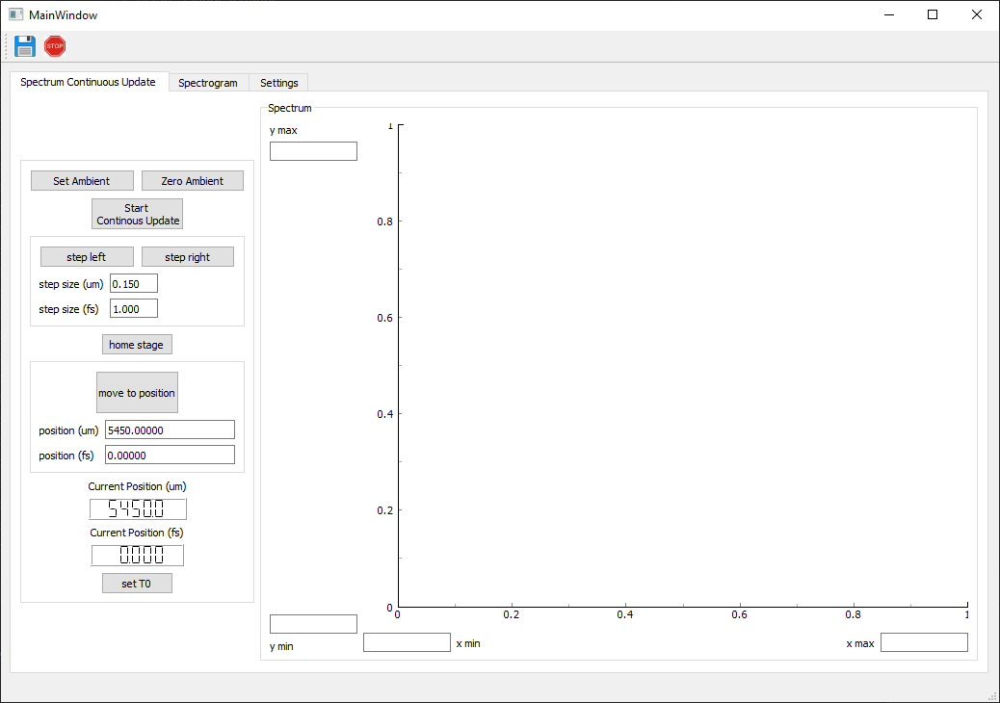
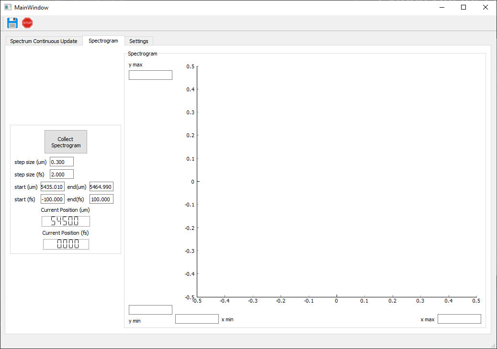
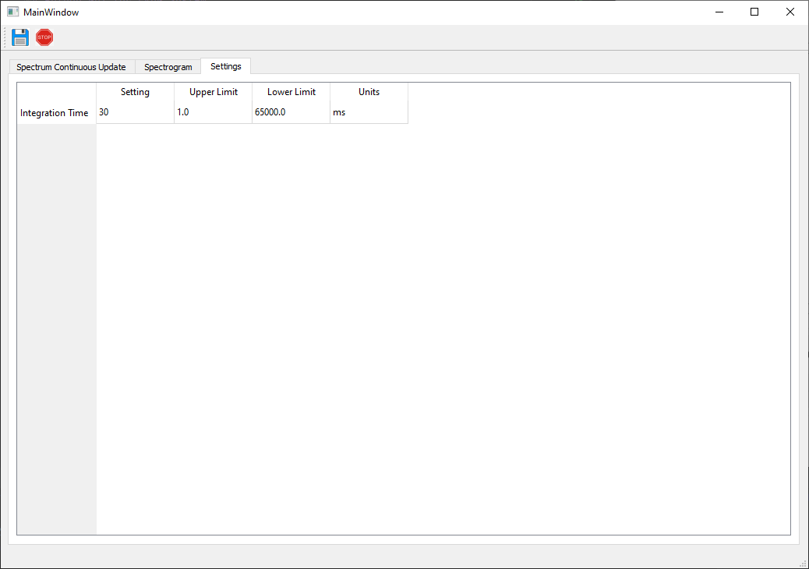

# Python FROG GUI
A general, extensible framework for taking FROG measurements with a linear delay stage. 

 

## Installation
Run `pip install git+https://github.com/UCBoulder/frogware.git` in your choice of virtual environment.
The script is then executed with `frogware`. If you are not familiar with python or want a
standalone executable, instead install with [`pipx`](https://github.com/pypa/pipx?tab=readme-ov-file).

### Dependencies
* `ocean.py` relies on the cseabreeze backend to communicate with OceanOptics spectrometers. 
This can be obtained from either OceanView or OceanDirect (proprietary).

## For Users

**Spectrum Continuous Update Tab:**
* Use the "Start Continuous Update" button to have the spectrum be updated continuously.
* Use the "Set Ambient" button to set the current spectrum as the ambient background (will be subtracted from future spectra)
* You can reset the ambient background to an arrya of 0's by hitting "Zero Ambient"
* You can step the translation stage towards the origin (step left) and away from the origin (step right) using the "step left" and "step right" button.
  * The step size can be set either in micron or in fs in the line edits.
* Use the home stage button to home the motor.
* You can set the desired position either in micron or fs, and then hit the "move to position button" to move there.
* The current stage position is given on the lcd display in micron and fs (with fs defined by where T0 is)
* Hit the "set T0" button to set the current stage position (read off the lcd display) as T0

**Spectrogram Tab:**

* T0 needs to have been set on the "Spectrum Continuous Update Tab"
* Set the step size, start position, and end position in either fs or micron
* Hit "Collect Spectrogram" to begin the spectrogram collection

**Settings Tab:**
* The only setting I have right now is the integration time for the spectrometer. 

**General Gui User Notes:**
If you hit any button that tells the spectrometer or the motor to do something while the spectrometer or the motor is already in use, the effect will be to stop whatever the spectrometer or motor is currently doing. 

For example, if the motor is currently homing and you hit the "step right" or "move to position" button, the motor will simply stop moving. Only after the program has detected that the motor is no longer in motion, will hitting "move to position" etc. command the motor to move.

I have set a buffer in the program that will not allow the motor to move within 1 micron of its limits. If one attempts to do this, it will pop an error window instead. If you don't want to have this buffer, then change edge_limit_buffer_mm in `gui_controller.py` to 0. 

## For Developers

* `device_interfaces.py` : Interfaces corresponding to the motor (LinearMotor) and spectrometer (Spectrometer). To include new hardware, implement all of the
methods indicated in each interface, as well as any exception handling listed in the docstrings.

* `kinesis.py` : Implements the LinearMotor interface for Thorlabs Kinesis devices. 

* `ocean.py` : Implements the Spectrometer interface for OceanOptics spectrometers.

* `connect_devices.py` : Explicitly connects each device, with corresponding exception handling.

This program communicates with the hardware using an object-oriented approach. To extend the use of
this code to new hardware, create a subclass of the LinearMotor and Spectrometer interfaces in a new file under `hardware_comms/`. The
main program should handle the rest of the work. 